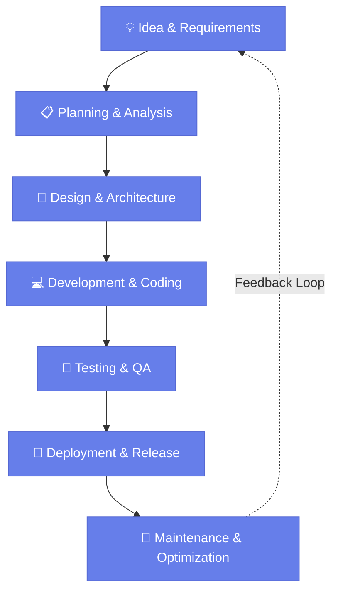

<div align="center">


</div>

<div align="center">

[](https://maps.google.com/?q=Andhra_Pradesh)
[](https://www.linkedin.com/in/tharund07/)
[](mailto:tharund449@gmail.com)
[](https://github.com/tharund44)


</div>

---

## 👨‍💻 About Me

I'm a **Computer Science Engineering student** at Madanapalle Institute of Technology & Science with a strong passion for building **scalable, efficient backend systems**. Currently working as a **Java Developer Intern** and exploring cloud technologies through the AICTE Cisco Virtual Internship Program.

My engineering philosophy centers on writing **clean, maintainable code**, solving complex problems with optimal algorithms, and continuously learning emerging technologies. I'm driven by the challenge of building systems that make an impact.

### 🎯 Open To
- **Opportunities**: Full-Time Backend/Full-Stack roles at top product companies
- **Collaborations**: Open Source contributions & technical mentoring
- **Learning**: Advanced system design, distributed systems, and cloud architecture

---

## 🛠️ Tech Arsenal

### 💻 Languages


### 🎨 Frontend


### 🔧 Backend


### 🗄️ Databases


### ☁️ Cloud & DevOps


### 🛠️ Tools & Platforms


---

## 💡 Engineering Philosophy

> *"The best code is not the one that does everything. It's the one that solves the problem elegantly, scales gracefully, and reads like a well-written essay. Every function should have a purpose, every variable should have a meaning, and every system should have a soul."*

**My Principles:**
- **Clean Code**: Readability and maintainability over cleverness
- **Scalability**: Design systems that grow with demand
- **Problem Solving**: Algorithms, data structures, and optimal solutions
- **Continuous Learning**: Stay updated with industry best practices
- **Collaboration**: Share knowledge and lift others up

---

## 🚀 Featured Projects

<details open>
<summary><b>📚 Sakura Nihongo - Japanese Learning Dashboard</b></summary>

A comprehensive web-based Japanese language learning platform built with modern full-stack technologies.

**Tech Stack:** Spring Boot | Thymeleaf | H2 Database | HTML5 | CSS3 | JavaScript

**Architecture:** 
- RESTful backend with Spring MVC
- Server-side rendering with Thymeleaf
- Embedded H2 database for data persistence

**Key Features:**
- 🎌 Interactive Hiragana, Katakana, and Kanji learning
- 📝 Grammar lessons with progressive difficulty
- 📊 Progress tracking and statistics
- 🎯 Spaced repetition system for vocabulary retention
- 📱 Responsive design for desktop and mobile

**Impact:** Helping learners efficiently progress from beginner to intermediate Japanese proficiency

**Future Improvements:** API migration for mobile app, real-time collaboration features, AI-powered pronunciation feedback

[](https://github.com/tharund44/sakura-nihongo)

</details>

<details>
<summary><b>🎵 Sangeetham - Music Streaming Application</b></summary>

A full-featured music streaming platform designed with scalability and user experience in mind.

**Tech Stack:** Java | Spring Boot | PostgreSQL | React | AWS

**Architecture:**
- Microservices-oriented design
- JWT authentication and authorization
- Cloud-based file storage with AWS S3
- Caching layer for performance optimization

**Key Features:**
- 🎧 Stream unlimited music with high-quality audio
- 📋 Create and manage custom playlists
- 🎯 Intelligent recommendations engine
- 👥 Social sharing and collaborative playlists
- 📊 User analytics and listening statistics

**Impact:** Demonstrates full-stack proficiency with cloud integration and real-world application design

**Future Improvements:** ML-based recommendations, podcast support, offline sync, multi-device synchronization

[](https://github.com/tharund44/sangeetham)

</details>

<details>
<summary><b>🎯 HabitBloom - Habit Tracking & Goal Management</b></summary>

A modern habit tracking application designed to help users build positive behaviors through consistent tracking and insightful analytics.

**Tech Stack:** Spring Boot | MySQL | React | Node.js | Express

**Architecture:**
- Clean layered architecture with separation of concerns
- Real-time notifications using WebSockets
- Efficient database indexing for query optimization

**Key Features:**
- 📅 Daily habit tracking with streak counters
- 📈 Visual progress charts and analytics
- 🔔 Smart reminders and notifications
- 🏆 Gamification with badges and achievements
- 📱 Mobile-first responsive design

**Impact:** Empowers users to track and improve their daily habits with data-driven insights

**Future Improvements:** Habit recommendations AI, social challenges, wearable device integration

[](https://github.com/tharund44/habitbloom)

</details>

<details>
<summary><b>📎 Smart Attendance Management System</b></summary>

Enterprise-grade attendance tracking solution with advanced reporting and analytics capabilities.

**Tech Stack:** Java | Spring Boot | MySQL | HTML5 | CSS3

**Architecture:**
- Role-based access control (RBAC)
- Automated report generation
- Email notification system

**Key Features:**
- ✅ Biometric and manual attendance tracking
- 📊 Advanced reporting and analytics
- 🔐 Secure authentication and authorization
- 📧 Automated absence notifications
- 📱 Staff dashboard with real-time updates

**Impact:** Streamlines attendance management for educational institutions and corporate offices

[](https://github.com/tharund44/attendance-tracker)

</details>

<details>
<summary><b>🎬 Movie Ticket Booking System</b></summary>

A scalable online ticketing platform for cinema chains with real-time seat management.

**Tech Stack:** Spring Boot | PostgreSQL | React | Redis | Docker

**Architecture:**
- Distributed transaction handling
- Redis caching for high-throughput seat queries
- Docker containerization for deployment

**Key Features:**
- 🎭 Browse movies and showtimes
- 💺 Real-time seat selection and availability
- 💳 Secure payment integration
- 🎫 E-ticket generation and mobile delivery
- 📧 Booking confirmations and reminders

**Impact:** Handles concurrent user requests efficiently with sub-second seat availability updates

[](https://github.com/tharund44/movie-booking)

</details>

---

## 💼 Professional Experience

### Java Developer Intern | The Website Makers
**ISO 9001:2015 Certified** | Full-time

**Duration:** [Current]

**Responsibilities:**
- Developed and optimized RESTful APIs using Spring Boot framework
- Designed and implemented database schemas for multiple projects
- Performed code reviews and maintained high code quality standards
- Collaborated with frontend teams on integration and API contracts
- Contributed to technical documentation and deployment procedures

**Technologies:** Java, Spring Boot, Spring Data JPA, MySQL, PostgreSQL, RESTful APIs, Git

---

### AICTE Cisco Virtual Internship Program 2026
**AI Track** | Madanapalle Institute of Technology & Science

**Focus Areas:**
- Machine Learning fundamentals and applications
- Cloud computing with AWS
- Network architecture and design
- AI implementation strategies

---

## 🏆 Certifications

### ☁️ AWS
- AWS Certified Cloud Practitioner (In Progress)
- AWS Solutions Architect Associate (Target)

### 🗄️ Oracle
- Oracle Certified Associate Java Programmer (Target)
- Oracle Database Administration (Target)

### 🔗 Cisco
- Cisco Certified Network Associate (CCNA) (In Progress)
- Enterprise Networking, Security, and Automation

### 📚 NPTEL
- Database Management Systems (DBMS)
- Algorithms: Design and Analysis
- Data Structures and Algorithms

### 🏢 Other
- Google Cloud Associate Cloud Engineer (Target)
- Microsoft Azure Fundamentals (Target)

---

## 💻 Coding Profiles

<div align="center">

[](https://leetcode.com/tharund44)
[](https://auth.geeksforgeeks.org/user/tharund44)
[](https://www.codechef.com/users/tharund44)
[](https://www.hackerrank.com/tharund44)

</div>

---

## 📊 GitHub Analytics

<div align="center">


</div>

<div align="center">


</div>

<div align="center">


</div>

<div align="center">


</div>

---

## 🎯 Current Focus

```yaml
learning:
  - Advanced System Design patterns
  - Distributed Systems architecture
  - Cloud security and compliance
  - Microservices best practices

building:
  - Full-stack applications with modern tech
  - Open-source contributions
  - Side projects for portfolio
  - Personal knowledge base

exploring:
  - Kubernetes and container orchestration
  - Event-driven architecture
  - NoSQL database patterns
  - GraphQL APIs

reading:
  - "System Design Interview" by Alex Xu
  - "Clean Code" by Robert C. Martin
  - "Designing Data-Intensive Applications"
  - AWS whitepapers and case studies

2026_goals:
  - Secure internship at top product company
  - Contribute meaningfully to open source
  - Master system design concepts
  - Build 3+ production-ready projects
  - Achieve AWS Solutions Architect certification
```

---

## 🔄 Development Workflow



---

## 🎉 Fun Section

<div align="center">

### 💬 Random Dev Quote
### 😄 Developer Joke
### 🎬 Coding Motivation


</div>

---

## 🔗 Connect With Me

<div align="center">

[](https://github.com/tharund44)
[](https://www.linkedin.com/in/tharund07/)
[](mailto:tharund449@gmail.com)

</div>

---

<div align="center">


<sub>**Made with ❤️ by Tharun Dudekula** | *Continuously Learning & Growing* | Last Updated: 2026</sub>

</div>
